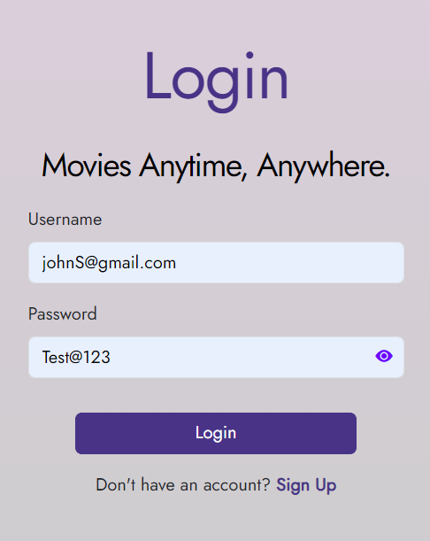

# Challenge 1

## Overview

Challenge 1 is focused on authentication.

**This challenge consists of three sub-challenges.**

- Password Validation
- Send an error message message if login credentials are incorrect
- Toggle password visibility

## a. Show meaningful messages for invalid password


In the current application, when the user entered password is invalid, the system shows a generic error message. The challenge is to show a meaningful error message to the user when the password entered by the user is invalid.

<p align="center">
  
</p>

The password entered by the user should meet the following criteria:

- At least 8 characters long
- No more than 25 characters long
- Should contain at least one uppercase letter, one lowercase letter, one number, and one special character

If any of the above criteria are not met, an error message should be displayed to the user.

#### Scenario 1

**Input**

```json
{
  "firstName": "test1",
  "lastName": "test1",
  "email": "test1@gmail.com",
  "password": "test1"
}
```

**Output**

```json
{
  "message": "Password should be at least 8 characters long"
}
```

<p align="center">
  
</p>

#### Scenario 2

**Input**

```json
{
  "firstName": "test1",
  "lastName": "test1",
  "email": "test1@gmail.com",
  "password": "test@123123123123123123123"
}
```

**Output**

```json
{
  "message": "Password must not be more than 25 characters long"
}
```

<p align="center">
  
</p>

#### Scenario 3

**Input**

```json
{
  "firstName": "test1",
  "lastName": "test1",
  "email": "test1@gmail.com",
  "password": "test@123"
}
```

**Output**

```json
{
  "message": "Password must contain at least one uppercase letter, one lowercase letter, one number and one special character"
}
```

<p align="center">
  
</p>

#### Scenario 4

**Input**

```json
{
  "firstName": "test1",
  "lastName": "test1",
  "email": "test1@gmail.com",
  "password": "Test@123"
}
```

**Output**

```json
{
  "message": "User created successfully"
}
```

<p align="center">
  
</p>

## b. Send a generic error message message if login credentials are incorrect

In the current application, when user logs in if the email is incorrect, it shows `Incorrect email` and if the password is incorrect it shows `Incorrect password`.

The goal is to enhance the security and user experience by showing a generic error message. Instead of revealing whether the email or password is incorrect, the application should display a single message: `Invalid email or password`.

#### Example scenario 1 - Incorrect email

**Input**

```json
{
  "email": "johngmail.com",
  "password": "Test@123"
}
```

**Output**

```json
{
  "message": "Invalid email or password"
}
```

#### Example scenario 1 - Incorrect password

**Input**

```json
{
  "email": "johngmail.com",
  "password": "Testing@123"
}
```

**Output**

```json
{
  "message": "Invalid email or password"
}
```

<p align="center">
  
</p>

## c. Toggle password visibility

Currently system has a toggle password visibility button. However, the password is not displayed in plain text when the eye icon is clicked. The challenge is to display the password in plain text when the eye icon is clicked.

<p align="center">
  
  <p align="center"><b>Before clicking the eye icon</b></p>
 
</p>
<p align="center">

  <p align="center"><b>After clicking the eye icon</b></p>
</p>

This challenge should be implemented in the `client/login.html` file. The eye-icon is already provided in the file.

<p align="center">
  
</p>

You need to implement the following,

- When the eye icon is not clicked its color should be `rgb(204, 204, 204)` and the password should be hidden.
- When the eye icon is clicked its color should be `rgb(111, 0, 255)` and the password should be displayed in plain text.

**Important: You need to implement this javascript and styling in the `client/login.html` file. Otherwise the challenge will not be considered as completed.**
