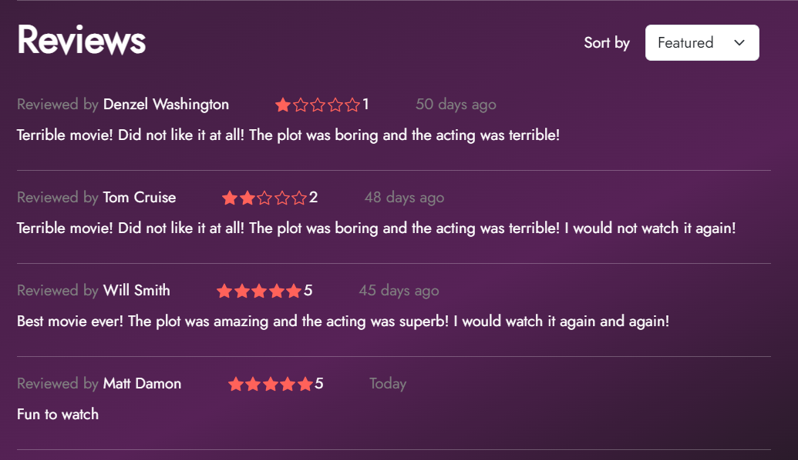
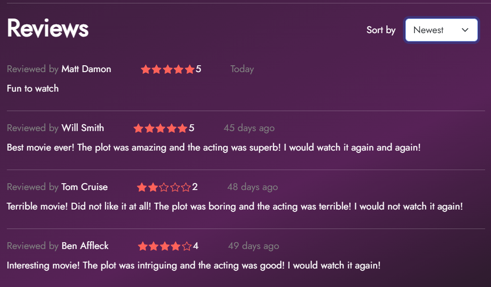
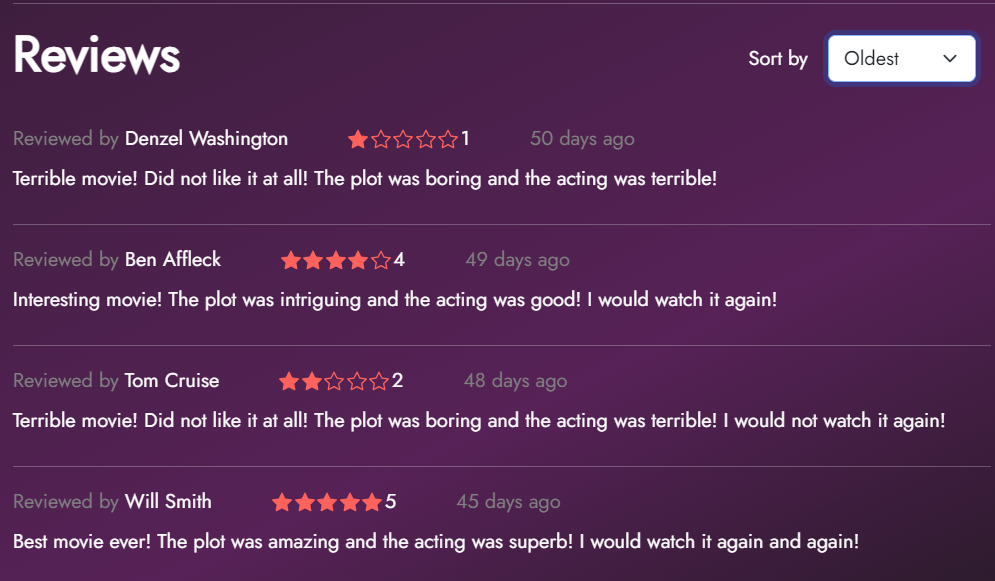
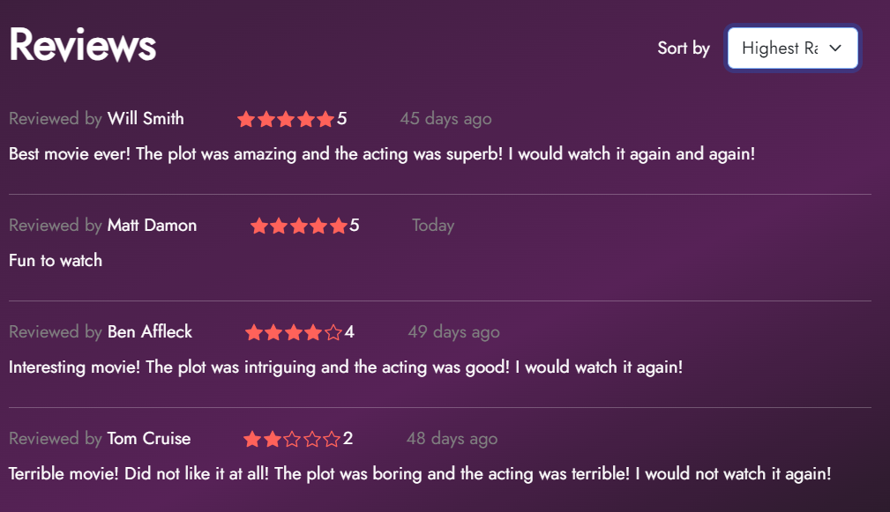
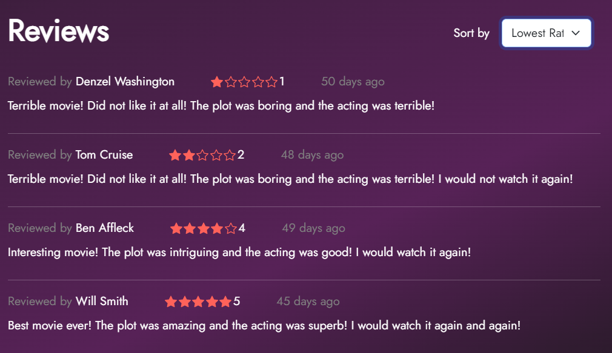

# Challenge 9

## Overview

The challenge is based on retrieving and sorting feedbacks for a movie. It has 3 sub challenges:

- Get all feedback for a movie
- Show top 2 rated and bottom 2 rated feedbacks for a movie
- Sort feedbacks

## a. get all feedback for a movie

The `getAllFeedbackForMovie()` function in the `feedbackRepository` retrieves all feedback for a movie from the database. After retrieving the feedback, it uses the `modifyFeedbackResponse()` function from the `feedbackController` to:

1. Convert the `createdAt` attribute of each feedback object to a "days ago" format.
2. Add the user's full name to each feedback object.
3. Remove movieId from the feedback object.

Finally, it returns the modified feedback.

However, there are some bugs in the current implementation:

1. The `createdAt` attribute of each feedback object is in the format `YYYY-MM-DDTHH:MM:SS.MMMZ`. It should be converted to a "days ago" format.

2. The `name` attribute of each feedback object is the `userId` of the user. It should be converted to the full name of the user.  

You need to fix these bugs in the `modifyFeedbackResponse()` function in the `feedbackController`.

The request should be a `GET` request to `/api/feedback/movie/:movieId`.

**Response for the `GET  /api/feedback/movie/6ba1472e-563c-4dbd-ad31-d78aec32f5af`**

```json
{
  "data": [
    {
            "name": "Denzel Washington",
            "userId": "4a90e4f3-d695-4c54-a698-099cdb39e4ad",
            "rating": 1,
            "comment": "Terrible movie! Did not like it at all! The plot was boring and the acting was terrible!",
            "createdAt": "174 days ago"
        },
        {
            "name": "Ben Affleck",
            "userId": "fce17e94-3415-4c08-b2c9-beddba191b4d",
            "rating": 4,
            "comment": "Interesting movie! The plot was intriguing and the acting was good! I would watch it again!",
            "createdAt": "173 days ago"
        },
        {
            "name": "Tom Cruise",
            "userId": "4fd09491-2299-4684-a4fb-d7ca0bb074eb",
            "rating": 2,
            "comment": "Terrible movie! Did not like it at all! The plot was boring and the acting was terrible! I would not watch it again!",
            "createdAt": "172 days ago"
        },
        {
            "name": "Will Smith",
            "userId": "999da33d-74c3-4176-bb26-98c53215a71c",
            "rating": 5,
            "comment": "Best movie ever! The plot was amazing and the acting was superb! I would watch it again and again!",
            "createdAt": "169 days ago"
        },
        {
            "name": "Matt Damon",
            "userId": "da9347a6-2a7f-4573-be27-15f05569fb0d",
            "rating": 3,
            "comment": "Average movie! The plot was ok and the acting was average! I would not watch it again!",
            "createdAt": "169 days ago"
        }
        {
            "name": "John Smith",
            "userId": "c784dd78-b26e-4cc0-9c8a-b84bdb4330b9",
            "rating": 5,
            "comment": "Fun to watch",
            "createdAt": "Today"
        }
  ]
}
```

## b. Show top 2 rated and bottom 2 rated feedbacks for a movie

On the movie page of the application, the default feedbacks displayed should be the two feedbacks with the highest ratings and the two feedbacks with the lowest ratings for the respective movie.

In this challenge you need to implement the `getTopBottomFeedbacks()` function in the `/controller/feedbackController.js` file to get the two highest rated feedbacks and two lowest rated feedbacks. You can use the `getAllFeedbackForMovie()` function in the `/repositories/feedbackRepository.js` file to get all feedbacks for a movie.

**Then retrieve the two highest rated feedbacks and two lowest rated feedbacks and sort the feedbacks from lowest to highest rating.**

**Note - If there are 4 or fewer feedbacks for a movie, return all the feedbacks from lowest to highest rating.**

Next, using the `modifyFeedbackResponse()` function, convert the createdAt attribute of a feedback object to days ago format and return the modified response.

The request should be a `GET` request to `/api/feedback/movie/top-bottom/:movieId`.

**Response for the `GET  /api/feedback/movie/top-bottom/6ba1472e-563c-4dbd-ad31-d78aec32f5af`**

```json
{
  "data": [
    {
      "name": "Denzel Washington",
      "userId": "4a90e4f3-d695-4c54-a698-099cdb39e4ad",
      "rating": 1,
      "comment": "Terrible movie! Did not like it at all! The plot was boring and the acting was terrible!",
      "createdAt": "50 days ago"
    },
    {
      "name": "Tom Cruise",
      "userId": "4fd09491-2299-4684-a4fb-d7ca0bb074eb",
      "rating": 2,
      "comment": "Terrible movie! Did not like it at all! The plot was boring and the acting was terrible! I would not watch it again!",
      "createdAt": "48 days ago"
    },
    {
      "name": "Will Smith",
      "userId": "999da33d-74c3-4176-bb26-98c53215a71c",
      "rating": 5,
      "comment": "Best movie ever! The plot was amazing and the acting was superb! I would watch it again and again!",
      "createdAt": "45 days ago"
    },
    {
      "name": "Matt Damon",
      "userId": "da9347a6-2a7f-4573-be27-15f05569fb0d",
      "rating": 5,
      "comment": "Fun to watch",
      "createdAt": "Today"
    }
  ]
}
```



## c. Sort feedbacks

In the movie page of the application, the user should be able to sort feedback based on time and rating and retrieve first 4 feedbacks.

Use `GET /api/feedback/movie/sort/${movieId}/?option=${option}&order=${order}` to sort feedbacks. The `option` parameter can be either `time` or `rating`, while the `sort` parameter can be `asc` or `desc`.

This can be divided into 4 sub-challenges:
 
1. Sort from newest to oldest feedbacks
   **Request-**`GET /api/feedback/movie/sort/:movieId/time/desc`
   **Response for**`GET /api/feedback/movie/sort/6ba1472e-563c-4dbd-ad31-d78aec32f5af/time/desc`

```json
{
  "data": [
    {
      "name": "John Smith",
      "userId": "c784dd78-b26e-4cc0-9c8a-b84bdb4330b9",
      "rating": 5,
      "comment": "Fun to watch",
      "createdAt": "Today"
    },
    {
      "name": "Matt Damon",
      "userId": "da9347a6-2a7f-4573-be27-15f05569fb0d",
      "rating": 3,
      "comment": "Average movie! The plot was ok and the acting was average! I would not watch it again!",
      "createdAt": "2024-03-12T11:30:00.000Z"
    },
    {
      "name": "Will Smith",
      "userId": "999da33d-74c3-4176-bb26-98c53215a71c",
      "rating": 5,
      "comment": "Best movie ever! The plot was amazing and the acting was superb! I would watch it again and again!",
      "createdAt": "2024-03-12T04:30:00.000Z"
    },
    {
      "name": "Tom Cruise",
      "userId": "4fd09491-2299-4684-a4fb-d7ca0bb074eb",
      "rating": 2,
      "comment": "Terrible movie! Did not like it at all! The plot was boring and the acting was terrible! I would not watch it again!",
      "createdAt": "2024-03-09T04:30:00.000Z"
    }
  ]
}
```



2. Sort from oldest to newest feedbacks
   **Request-**`GET /api/feedback/movie/sort/:movieId/time/asc`
   **Response for**`GET /api/feedback/movie/sort/ba1472e-563c-4dbd-ad31-d78aec32f5af/time/asc`

   ```json
   {
     "data": [
       {
         "name": "Denzel Washington",
         "userId": "4a90e4f3-d695-4c54-a698-099cdb39e4ad",
         "rating": 1,
         "comment": "Terrible movie! Did not like it at all! The plot was boring and the acting was terrible!",
         "createdAt": "2024-03-07T04:30:00.000Z"
       },
       {
         "name": "Ben Affleck",
         "userId": "fce17e94-3415-4c08-b2c9-beddba191b4d",
         "rating": 4,
         "comment": "Interesting movie! The plot was intriguing and the acting was good! I would watch it again!",
         "createdAt": "2024-03-08T04:30:00.000Z"
       },
       {
         "name": "Tom Cruise",
         "userId": "4fd09491-2299-4684-a4fb-d7ca0bb074eb",
         "rating": 2,
         "comment": "Terrible movie! Did not like it at all! The plot was boring and the acting was terrible! I would not watch it again!",
         "createdAt": "2024-03-09T04:30:00.000Z"
       },
       {
         "name": "Will Smith",
         "userId": "999da33d-74c3-4176-bb26-98c53215a71c",
         "rating": 5,
         "comment": "Best movie ever! The plot was amazing and the acting was superb! I would watch it again and again!",
         "createdAt": "2024-03-12T04:30:00.000Z"
       }
     ]
   }
   ```

   

  3. Sort feedbacks from the highest rating to lowest rating
   **Request-**`GET /api/feedback/movie/sort/:movieId/rating/desc`
   **Response for**`GET /api/feedback/movie/sort/ba1472e-563c-4dbd-ad31-d78aec32f5af/rating/desc`


   ```json
   {
     "data": [
       {
         "name": "Will Smith",
         "userId": "999da33d-74c3-4176-bb26-98c53215a71c",
         "rating": 5,
         "comment": "Best movie ever! The plot was amazing and the acting was superb! I would watch it again and again!",
         "createdAt": "2024-03-12T04:30:00.000Z"
       },
       {
         "name": "John Smith",
         "userId": "c784dd78-b26e-4cc0-9c8a-b84bdb4330b9",
         "rating": 5,
         "comment": "Fun to watch",
         "createdAt": "Today"
       },
       {
         "name": "Ben Affleck",
         "userId": "fce17e94-3415-4c08-b2c9-beddba191b4d",
         "rating": 4,
         "comment": "Interesting movie! The plot was intriguing and the acting was good! I would watch it again!",
         "createdAt": "2024-03-08T04:30:00.000Z"
       },
       {
         "name": "Matt Damon",
         "userId": "da9347a6-2a7f-4573-be27-15f05569fb0d",
         "rating": 3,
         "comment": "Average movie! The plot was ok and the acting was average! I would not watch it again!",
         "createdAt": "2024-03-12T11:30:00.000Z"
       }
     ]
   }
   ```

   

  4. Sort feedbacks from the lowest rating to highest rating
   **Request-**`GET /api/feedback/movie/sort/:movieId/rating/asc`
   **Response for**`GET /api/feedback/movie/sort/ba1472e-563c-4dbd-ad31-d78aec32f5af/rating/asc`

   ```json
   {
     "data": [
       {
         "name": "Denzel Washington",
         "userId": "4a90e4f3-d695-4c54-a698-099cdb39e4ad",
         "rating": 1,
         "comment": "Terrible movie! Did not like it at all! The plot was boring and the acting was terrible!",
         "createdAt": "2024-03-07T04:30:00.000Z"
       },
       {
         "name": "Tom Cruise",
         "userId": "4fd09491-2299-4684-a4fb-d7ca0bb074eb",
         "rating": 2,
         "comment": "Terrible movie! Did not like it at all! The plot was boring and the acting was terrible! I would not watch it again!",
         "createdAt": "2024-03-09T04:30:00.000Z"
       },
       {
         "name": "Matt Damon",
         "userId": "da9347a6-2a7f-4573-be27-15f05569fb0d",
         "rating": 3,
         "comment": "Average movie! The plot was ok and the acting was average! I would not watch it again!",
         "createdAt": "2024-03-12T11:30:00.000Z"
       },
       {
         "name": "Ben Affleck",
         "userId": "fce17e94-3415-4c08-b2c9-beddba191b4d",
         "rating": 4,
         "comment": "Interesting movie! The plot was intriguing and the acting was good! I would watch it again!",
         "createdAt": "2024-03-08T04:30:00.000Z"
       }
     ]
   }
   ```

   
