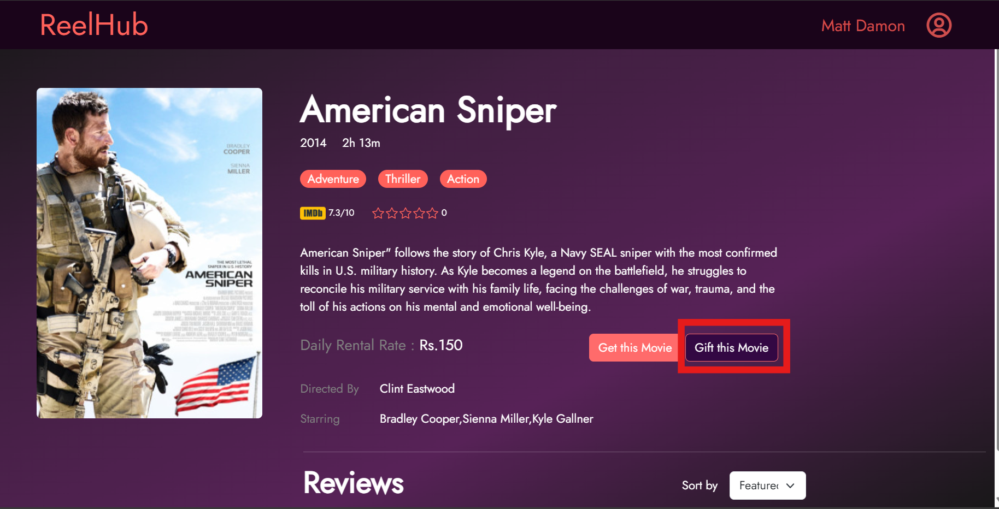
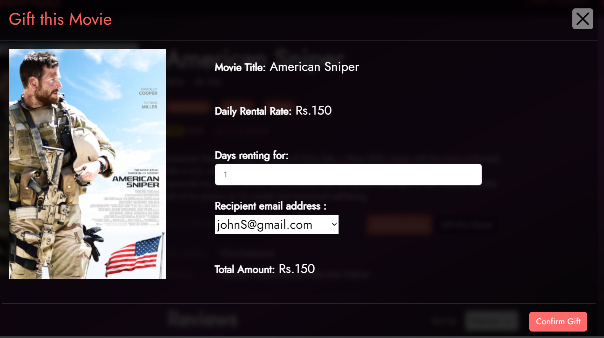

# Challenge 15 - Gift a rental

In this challenge you need to implement the gift rental functionality. Following endpoint is needed to be used.

```http
POST /api/rental/gift
```
One user can gift a rental to another user as they choose. In this scenario you need to implement `giftRental()` function in both `rentalController` and `rentalRepository`.

Let's assume there are two users called **A** and **B**. When user A want to gift a rental for the user B, he needs to select the particular movie he want to gift for B. 

Then he needs to select B's email and no of days that the rental is gifted. In the body of the request you need to send the `receiverEmail`, `movieId`, `daysRented` values. Using those values you need to find if there is an active rental of the given movie for the receiver.
1. If there is an active rental you need to update the daysRented and rentalFee of that rental by adding the gifted values.
2. Otherwise, you need to add a new rental for the recipient user.

In both of these scenarios, gifted rental fee should be deducted from the sender and should be updated in the database.

<p align="center">

</p>

<p align="center">

</p>
